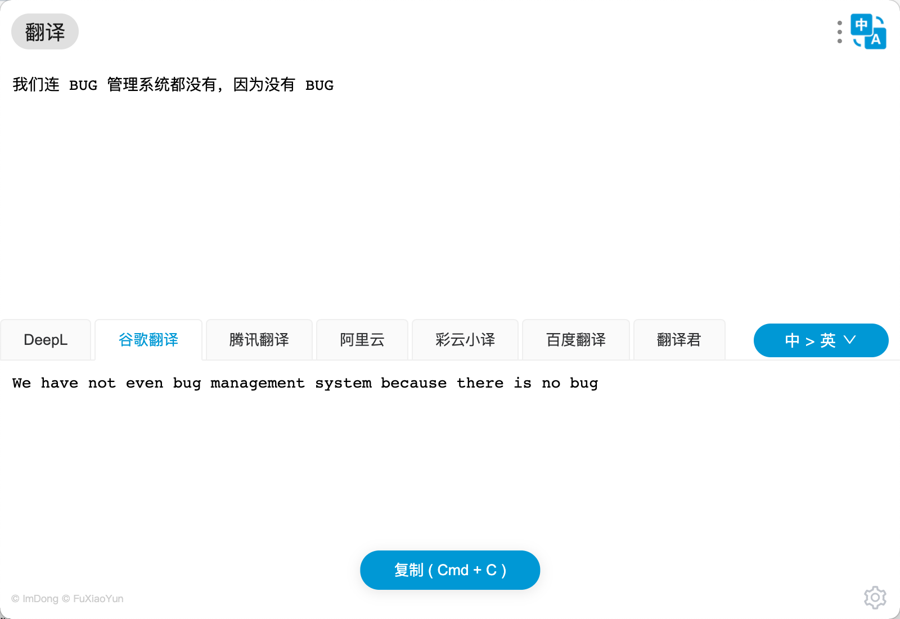
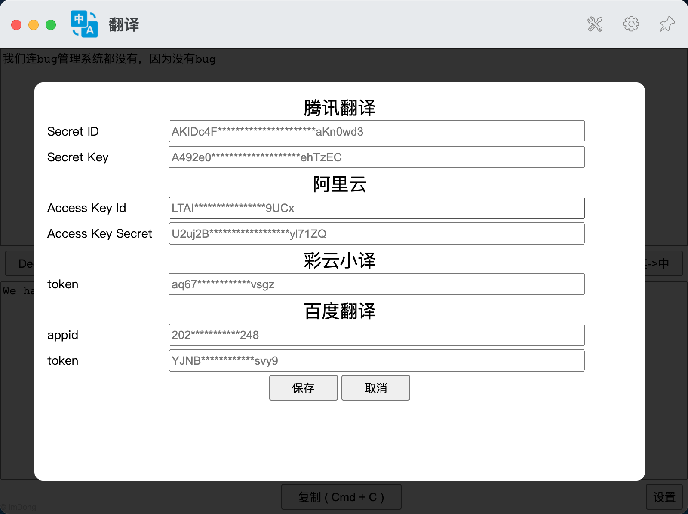

# uTools 翻译插件

一个比较轻巧的翻译插件，很不巧的是它依然需要联网。

## 预览图

## 功能规划 && 待办

- [x] 自定义 Key
- [ ] 翻译源增减排序
- [ ] 保存/设置默认源
- [ ] 多种翻译方向选择，自动->中，自动->英
- [ ] 样式调整（字体调大）
- [ ] 发音功能
- [ ] 更多语言互译
- [ ] 更多的翻译源选择

## 短期内不会增加的功能

    以下功能虽然暂时不会添加，但未来可能会在合适的时候考虑加入

- 同时多条翻译结果（原因：太烧钱，并且没有想到合理的展示样式）
